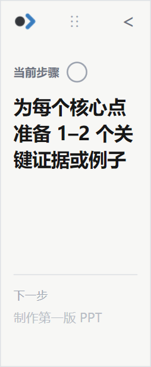
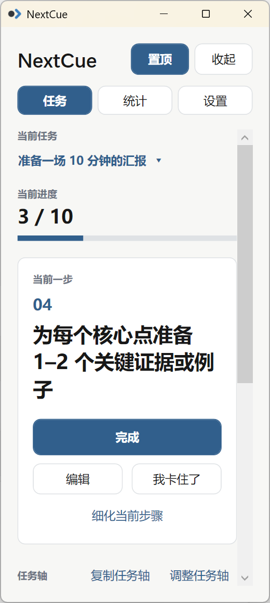
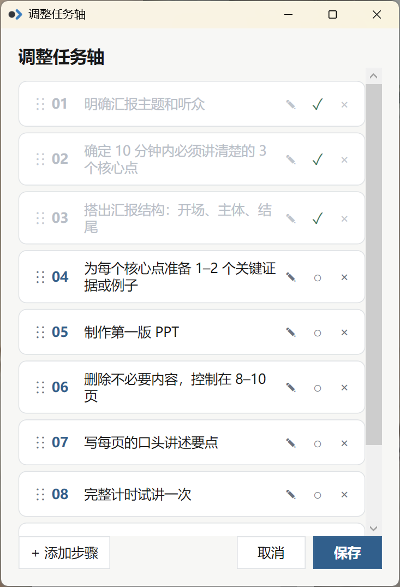
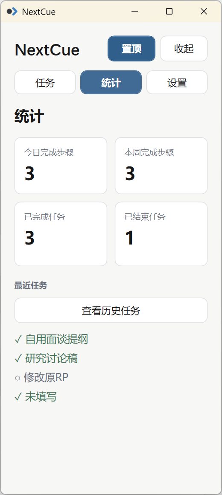

  

<h1 align="center">NextCue</h1>

  <strong>One cue at a time.</strong> 
  千里之行，始于足下。

  <a href="#english">English</a> | <a href="#简体中文">简体中文</a>

## English

### Overview

NextCue is a lightweight Windows desktop companion for breaking large, overwhelming tasks into clear, actionable steps.

It is useful for work, study, research, writing, presentations, planning, and other complex projects. Instead of showing the whole plan all the time, NextCue keeps the current step in focus and gives only a subtle preview of what comes next.

Ask ChatGPT or another GPT tool to break a task into numbered steps, then paste the result into NextCue. The plan becomes an editable task axis that emphasizes the current step and the next cue. GPT interaction is manual copy and paste; NextCue does not include built-in AI or OpenAI API integration.

### Features

- Paste numbered or bulleted steps generated by GPT.
- Edit the task axis and insert, edit, or delete individual steps.
- Reorder steps using drag and drop.
- Mark steps complete or incomplete.
- Keep the current step in focus with a subtle next-step preview.
- Use a movable, resizable compact sidebar mode.
- Keep NextCue above other windows with the always-on-top option.
- Keep multiple unfinished plans in the task library and switch between active tasks.
- End a task manually and review completed or ended plans in task history.
- View basic task statistics.
- Use the “I'm stuck” workflow to generate a re-breakdown prompt for GPT.
- Refine the current step manually at any time.
- Save task data locally and choose a custom data-storage directory.
- Use system tray support, close-to-tray, Start with Windows, and desktop shortcuts.

### How It Works

1. Describe your large task to ChatGPT.
2. Use NextCue's “copy task breakdown prompt” action.
3. Ask GPT to return numbered, actionable steps.
4. Copy the result from GPT.
5. Paste it into NextCue.
6. Work only on the current step.
7. Mark the step complete and move forward.

You can edit, reorder, add, or remove steps at any time.

### Installation

Download `NextCue-Setup-v0.1.0.exe` from [GitHub Releases](../../releases).

1. Run the installer.
2. Follow the setup wizard.
3. Launch NextCue from the Start Menu.
4. Optionally enable Always on top, Start with Windows, Close to tray, or a desktop shortcut.

### System Requirements

- Windows 11
- x64 processor
- The release build is self-contained.
- Visual Studio is not required for installation or normal use.

### Data & Privacy

NextCue stores task data locally. It does not require an OpenAI API key and does not automatically read ChatGPT conversations. GPT interaction currently uses manual copy and paste.

By default, the bootstrap configuration is stored at `%LOCALAPPDATA%\NextCue\config.json`, and application state is stored at `%LOCALAPPDATA%\NextCue\state.json`. You can choose another writable folder for application state in Settings. User task data is kept separately and is not bundled into the installer.

### Development Status

NextCue v0.1.0 is an early personal open-source release. The core workflow is functional, but some UX edge cases and Windows-specific behavior may be refined in later versions.

## Screenshots / 截图

<table>
  <tr>
    <td align="center" valign="top">
      <strong>Compact Mode / 收起模式</strong>  
       
      Focus on the current step with a subtle next-step preview. 只突出当前步骤，并轻量提示下一步。
    </td>
    <td align="center" valign="top">
      <strong>Main Task View / 主任务界面</strong>  
       
      Track progress and work through the active plan. 查看当前进度并推进当前任务。
    </td>
  </tr>
  <tr>
    <td align="center" valign="top">
      <strong>Editable Task Axis / 可编辑任务轴</strong>  
       
      Reorder, edit, complete, insert, or remove steps. 可拖拽排序、编辑、完成、插入或删除步骤。
    </td>
    <td align="center" valign="top">
      <strong>Statistics / 统计</strong>  
       
      Review recent activity and completion stats. 查看近期任务与基础完成统计。
    </td>
  </tr>
</table>

## 简体中文

### 简介

NextCue 是一个轻量级 Windows 桌面助手，用于把庞大、难以启动的任务拆成清晰、可执行的小步骤。

适用于工作、学习、科研、写作、汇报准备、规划和其他复杂任务。它不会一直把整座“任务大山”摆在眼前，而是把注意力集中在当前步骤，只轻量提示下一步。

你可以让 ChatGPT 或其他 GPT 工具先生成带编号的行动步骤，再把结果粘贴到 NextCue。NextCue 会将这些内容整理成可编辑的任务轴，帮助你一次只处理眼前的一步。目前 GPT 交互完全通过手动复制与粘贴完成，NextCue 不包含内置 AI，也不接入 OpenAI API。

### 主要功能

- 粘贴 GPT 生成的编号或项目符号步骤。
- 编辑任务轴，随时插入、修改或删除步骤。
- 通过拖放调整步骤顺序。
- 将步骤标记为已完成或恢复为未完成。
- 聚焦当前步骤，并弱化显示下一步预览。
- 使用可移动、可调整大小的收起态侧栏。
- 通过“置顶”让 NextCue 保持在其他窗口上方。
- 在任务库中保留多个未完成计划，并切换当前任务。
- 手动结束任务，在历史记录中查看已完成或已结束的计划。
- 查看基础任务统计。
- 在“我卡住了”流程中生成重新拆解任务的 GPT 提示词。
- 随时手动细化当前步骤。
- 在本地保存数据，并可自定义数据存储目录。
- 支持系统托盘、关闭到托盘、开机启动和桌面快捷方式。

### 使用方式

1. 向 ChatGPT 描述你想完成的大任务。
2. 使用 NextCue 的“复制任务拆解提示词”。
3. 请 GPT 返回带编号、可以直接行动的步骤。
4. 复制 GPT 的回答。
5. 将内容粘贴到 NextCue。
6. 只专注于当前步骤。
7. 完成后勾选该步骤，继续向前推进。

任务计划并非固定不变；你可以随时编辑、排序、增加或删除步骤。

### 安装

从 [GitHub Releases](../../releases) 下载 `NextCue-Setup-v0.1.0.exe`。

1. 运行安装程序。
2. 按照安装向导完成安装。
3. 从开始菜单启动 NextCue。
4. 可按需启用置顶、开机启动、关闭到托盘或桌面快捷方式。

### 系统要求

- Windows 11
- x64 处理器
- 发布版本为自包含构建。
- 普通安装和使用不需要 Visual Studio。

### 数据与隐私

NextCue 将任务数据保存在本地，不需要 OpenAI API Key，也不会自动读取 ChatGPT 对话。目前与 GPT 的协作方式是手动复制和粘贴。

默认情况下，引导配置保存在 `%LOCALAPPDATA%\NextCue\config.json`，应用状态保存在 `%LOCALAPPDATA%\NextCue\state.json`。你也可以在设置中选择其他可写目录保存应用状态。任务数据与程序安装文件相互独立，不会被打包进安装程序。

### 开发状态

NextCue v0.1.0 是一个处于早期阶段的个人开源版本。核心工作流已经可用，后续版本仍会继续改善交互细节和 Windows 环境下的边界情况。

## License / 许可证

This project is licensed under the MIT License. See [LICENSE](LICENSE) for details.

本项目采用 MIT License 开源，详见 [LICENSE](LICENSE)。
